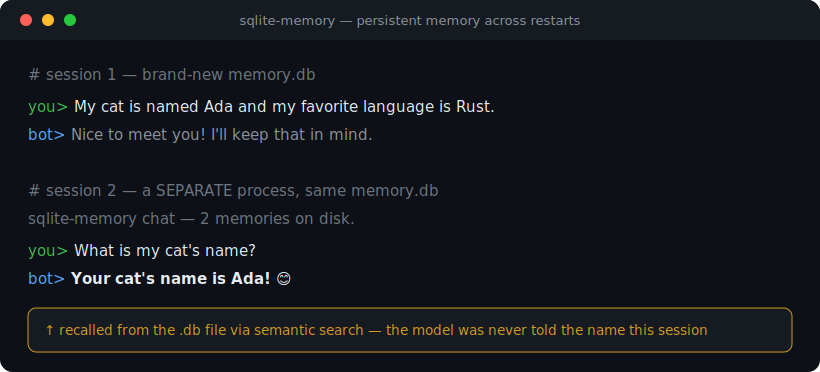

# sqlite-memory

**Give your local LLM persistent long-term memory — in one Python file. No vector DB, no server, no framework.**



LLMs forget everything the moment a message scrolls out of the context window,
and everything again when the process restarts. `sqlite-memory` is the smallest
possible fix: embed each fact or chat turn with a local [Ollama](https://ollama.com)
model, store it in a single SQLite file, and semantically `recall()` the relevant
bits before the model answers. The memory is just a `.db` file, so it survives
restarts and is trivial to back up or move.

## Why another memory library?

Projects like Mem0, Zep, Letta and Cognee are powerful but heavy: servers,
vector databases, cloud accounts, many dependencies. `sqlite-memory` trades
features for radical simplicity:

- **One file, standard library only** — `sqlite3`, `urllib`, `json`, `math`.
- **Local & private** — nothing leaves your machine.
- **No infrastructure** — no daemon, no vector DB; the index is a portable `.db`.
- **Readable in one sitting** — easy to audit and fork.

## Quickstart

```bash
ollama pull nomic-embed-text
ollama pull qwen2.5:7b
python example_chat.py     # tell it facts, quit, run again, ask about them
```

### It really persists across restarts (real run)

```text
# session 1 — brand-new memory.db
you> My cat is named Ada and my favorite language is Rust.
bot> Nice to meet you! A cat named Ada and you enjoy Rust — I'll keep that in mind.

# session 2 — a SEPARATE process, same memory.db
sqlite-memory chat — 2 memories on disk.
you> What is my cat's name?
bot> Your cat's name is Ada! 😊
```

> In session 2 the model was never told the name — it was recalled from the
> `.db` file via semantic search and injected into the prompt.

## API

```python
from sqlite_memory import Memory

mem = Memory("memory.db")
mem.remember("The user ships firmware for ESP32 boards", role="fact", tags="work")
mem.recall("what does the user work on?", k=5)   # semantic search -> list of hits
mem.recent(10)                                    # last N memories
mem.forget(tag="work")                            # or forget(id=..) / forget(before_ts=..)
```

## How it works

1. `remember(text)` embeds the text via Ollama's `/api/embeddings` and stores
   `(ts, role, text, tags, embedding)` in SQLite.
2. `recall(query)` embeds the query and ranks every stored memory by cosine
   similarity (computed in Python), returning the top-k.
3. In a chat loop you `recall()` before generating and inject the hits into the
   system prompt, then `remember()` the new turns.

## Configuration (env vars)

| Variable | Default |
|---|---|
| `OLLAMA_URL` | `http://127.0.0.1:11434` |
| `EMBED_MODEL` | `nomic-embed-text` |
| `CHAT_MODEL` (example only) | `qwen2.5:7b` |

## Limits (honest)

- Linear cosine scan — great up to tens of thousands of memories; add an ANN
  index beyond that.
- No automatic **consolidation or selective forgetting** (the hard, unsolved part
  of agent memory): `forget()` is manual/rule-based. Contributions welcome.
- Recall quality is only as good as the embedding model.

## License

MIT

---

## See also
Part of a small collection of **local-first AI** and **ESP32 / maker** tools:

- [sqlite-rag](https://github.com/CapitanaIcoachai/sqlite-rag) — minimal RAG — embeddings + cosine in SQLite, no vector DB
- [ollama-doctor](https://github.com/CapitanaIcoachai/ollama-doctor) — find out why Ollama is slow (CPU offload / VRAM)
- [local-voice-edge](https://github.com/CapitanaIcoachai/local-voice-edge) — ESP32 voice assistant + local STT→LLM→TTS server
- [axs15231b-landscape-lvgl](https://github.com/CapitanaIcoachai/axs15231b-landscape-lvgl) — 3.5" AXS15231B QSPI panel in landscape with LVGL
- [guition-esp32p4-lvgl9](https://github.com/CapitanaIcoachai/guition-esp32p4-lvgl9) — Guition 7" ESP32-P4 + LVGL 9 baseline
- [orcaslicer-cli-cookbook](https://github.com/CapitanaIcoachai/orcaslicer-cli-cookbook) — OrcaSlicer from the command line + fixes

⭐ If this saved you time, a star helps others find it.
